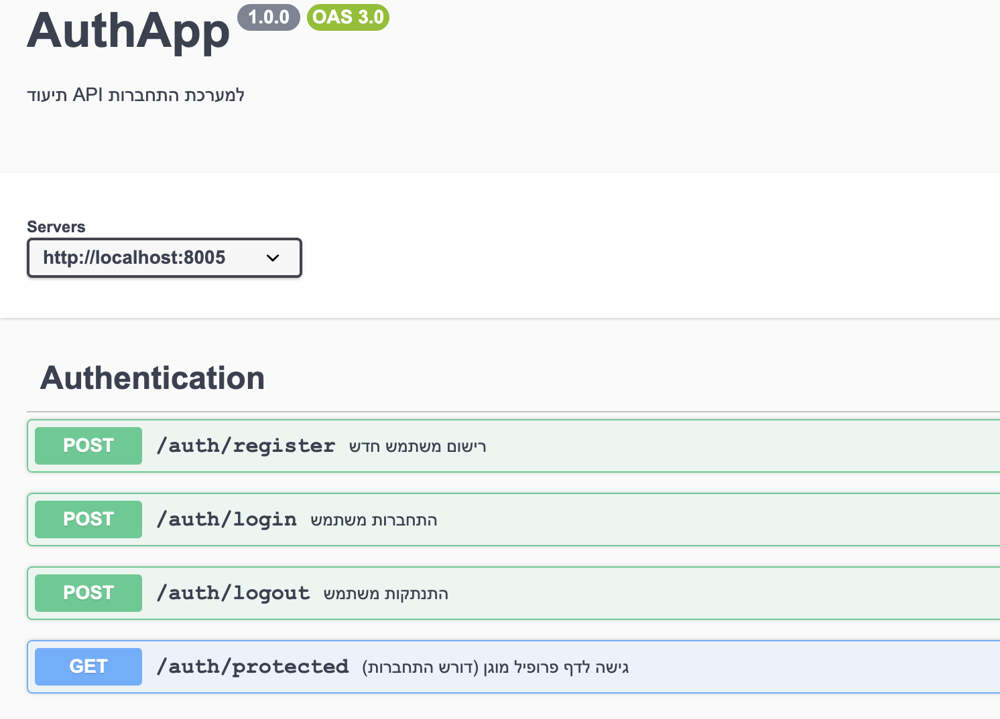

# 🔐 AuthApp
מערכת אימות משתמשים עם Node.js, TypeScript, Express, Mongodb, Mongoose ,Google OAuthו־Passport.

## 🚀 תכונות

- רישום והתחברות עם אימייל + סיסמה
- שמירת session עם `express-session`
- התחברות עם Google OAuth 2.0
- תיעוד API עם Swagger UI
- כתוב ב-TypeScript עם ארכיטקטורה מודולרית

- ## 🛠 התקנה

- git clone https://github.com/yuvalleberstein21/authApp.git
- cd passport
- npm install
 ##  צור קובץ .env
- MONGO_URI=your_mongodb_uri
- SESSION_SECRET=your_secret
- GOOGLE_CLIENT_ID=xxx
- GOOGLE_CLIENT_SECRET=xxx
- GOOGLE_CALLBACK_URL=http://localhost:8005/auth/google/callback

- ##  הרצת השרת
- npm start

- ## 📘 תיעוד API
- Swagger: http://localhost:8005/api-docs
- Google Login: דרך הדפדפן בלבד, ב־ http://localhost:8005/login.html
